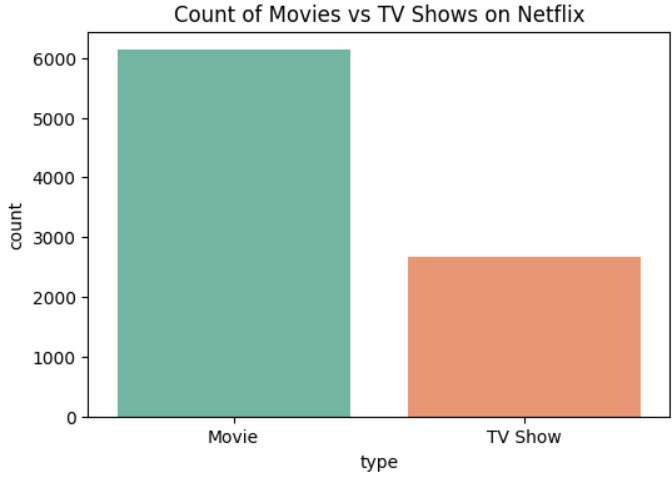
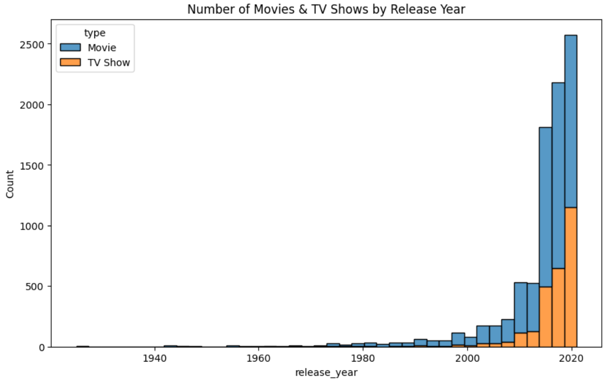
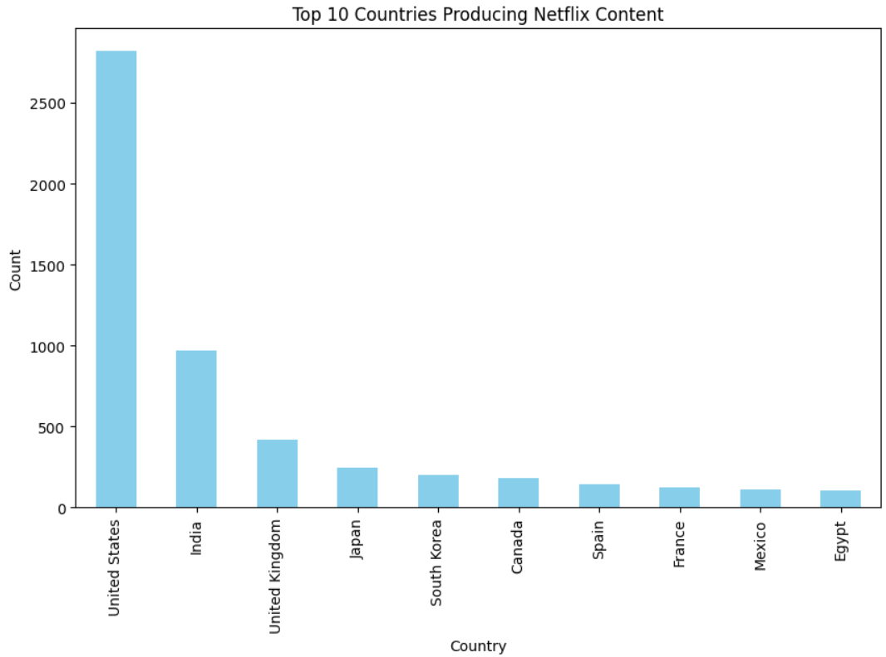

# Netflix Movies and TV Shows Analysis 🎬

## 📂 Dataset
The dataset is from [Kaggle](https://www.kaggle.com/shivamb/netflix-shows).  
It contains **8,807 rows and 12 columns**, including information about Movies and TV Shows such as title, director, cast, country, release year, rating, and genre.

## 📊 Visualizations
Here are some visualizations created using Seaborn and Matplotlib:

1. **Movies vs TV Shows count**  
   - Netflix has more Movies than TV Shows.
   

2. **Number of Movies & TV Shows by Release Year**  
   - Most content is recent, mainly after 2010. Few older titles exist.
   

3. **Top 10 Countries Producing Netflix Content**  
   - The U.S. dominates, followed by India and the U.K.
   

## 📝 Insights
- Netflix’s catalog is movie-heavy.  
- Netflix focuses on modern content, with most titles from the 2000s onwards.  
- While global, the platform is dominated by U.S. productions.  
